<pre><code>~/dev/info
▲ neofetch

oHqtegithub
--------
user.name     : &nbsp;oHqte
user.email    : &nbsp;&lt;ohqte@proton.me&gt;
user.uptime   : 04 days ago
user.site     : &nbsp;ohqte.pages.dev

user.socials  : &nbsp;codewars, &nbsp;discord, &nbsp;spotify
user.skills   : &nbsp;python, &nbsp;javascript, &nbsp;typescript, &nbsp;rust, &nbsp;SQL

user.views    : 10
user.repos    : 04
user.commits  : 09
 

~/dev/info
▲ octo-ring

:: A webring is a collection of websites that link to each other in a circle,
   with each site linking to the next and previous sites in the ring.

:: <ins>Octo Ring is the webring for GitHub!</ins>
  <table>
    <tr>
        <td>[prev]</td>
        <td>[random]</td>
        <td>[next]</td>
    </tr>
    <tr>
        <td>  <a href="https://octo-ring.com/p/oHqte/prev">◀</a></td>
        <td>   <a href="https://octo-ring.com/p/oHqte/random">↻</a></td>
        <td>  <a href="https://octo-ring.com/p/oHqte/next">▶</a></td>
    </tr>
</table></pre></code>
